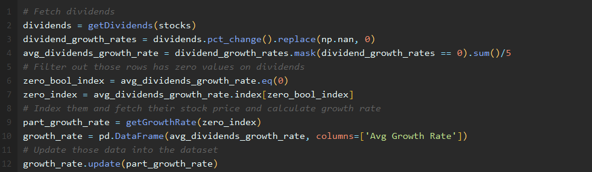
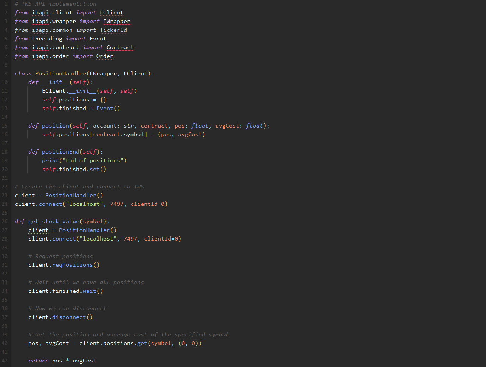
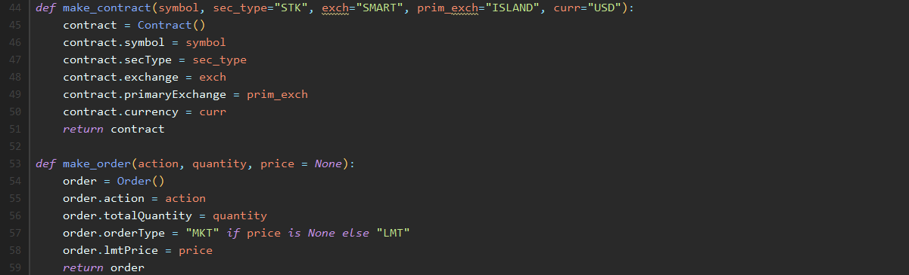
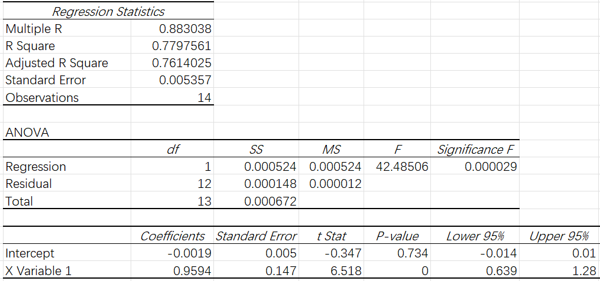
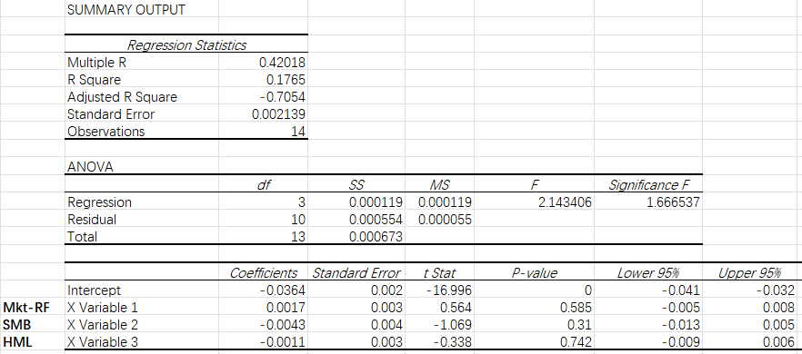

# **Investment Project**

# COMS W4995 Machine Learning with Applications in Finance - Final Report

July 2023

Tong Wu, tw2906

# Catalogue

[1. Scope](#scope)

[1.1. Context Definition](#context-definition)

[1.2. Investor Definition](#investor-definition)

[2. Investment, Return and Risk objectives](#investment-return-and-risk-objectives)

[2.1. Overall investment objectives](#overall-investment-objectives)

[2.2. Return, Distribution and Risk Requirements](#return-distribution-and-risk-requirements)

[2.3. Investor’s Risk Tolerance](#investors-risk-tolerance)

[2.4. Relevant Constraints](#relevant-constraints)

[2.5. Other Relevant Considerations](#other-relevant-considerations)

[3. Approach](#approach)

[3.1. Machine Learning Algorithm](#machine-learning-algorithm)

[3.2. Mean-variance Optimization](#mean-variance-optimisation)

[3.3. Index Model](#index-model)

[3.4. Capital Asset Pricing Model](#capital-asset-pricing-model)

[3.5. Arbitrage Theory and Multifactor Model](#arbitrage-theory-and-multi-factor-model)

[3.6. Equity Valuation Model](#equity-valuation-model)

[3.7. Black Litterman Model](#black-litterman-model)

[3.8. Algorithmic Trading](#algorithmic-trading)

[4. Stock selection](#stock-selection)

[5. Portfolio evaluation](#portfolio-evaluation)

[6. Portfolio performance](#portfolio-performance)

[6.1. Portfolio and Benchmark Statistics](#portfolio-and-benchmark-statistics)

[6.2. Performance Attribution](#performance-attribution)

[6.3. Factor Style Analysis – Fama French Three Factors Model](#factor-style-analysis--fama-french-three-factors-model)

[7. Analysis and conclusion](#analysis-and-conclusion)

[7.1. Exceed Expectations Exceed Expectations](#exceed-expectations-exceed-expectations)

[7.2. Underperformed Expectations](#underperformed-expectations)

[7.3. Key Learnings](#key-learnings)

[7.4. Future Influence](#future-influence)

[8. References](#references)

# Scope

In the dynamic world of investments, it is crucial to thoroughly understand the context in which the investment program will be executed and the principal (investor) of the investment plan. This detailed comprehension is the backbone of financial planning and portfolio management.

## Context Definition

The context, in this case, involves \$1 million, which is part of the client's free assets, to be invested in stocks for optimal returns. Given the substantial nature of this amount, our approach towards this investment needs to be methodical, precise, and entirely in line with the client's risk profile. We aim to create a diversified portfolio that optimises returns while effectively managing risks, and we will be leveraging various financial models, coupled with machine learning algorithm optimisation, to achieve this goal.

The investment horizon is fairly short-term, considering we will manage these assets for less than a month. The short time frame will factor into the decision-making process, given that our portfolio selection must balance potential short-term market volatilities while targeting optimal returns. However, we must prioritise the portfolio's performance in a long-term framework. The portfolio's long-term return determines whether the client can continue to contract with us.

## Investor Definition

Our client is a young entrepreneur with an internationally successful company. The source of wealth is the company's several product lines, which are sold globally and hold a significant market share. This business success has afforded the client an accumulation of free assets, and a portion of these - a sum of \$1 million - that the client has entrusted us for investment.

Although the client's business acumen will likely be advantageous in understanding the stock market dynamics, we must remember that the investor's primary area of expertise is entrepreneurship and not necessarily investment management, and this forms the basis of their trust in us to manage their assets effectively.

We are thus committed to creating a strategy that respects the client's entrepreneurial spirit, risk appetite, and short-term investment timeline while deeply rooted in established financial models enriched by the power of machine learning algorithms for portfolio optimisation. We will embark on this journey focusing on transparency, communication, and achieving the optimal balance between risk and return.

# Investment, Return and Risk Objectives

## Overall investment objectives

Our primary objective for this investment is to generate the highest possible return without exposing our client's portfolio to excessive risk. We aim to create a well-diversified investment portfolio primarily consisting of equities, considering their potential for higher returns in a shorter period. The chosen strategy will balance the need for portfolio growth with risk management, aligning with the client's risk tolerance. (“Elements of an Investment Policy Statement for Individual Investors” n.d.)

## Return, Distribution and Risk Requirements

Given the relatively short investment horizon of less than a month, our strategy must accommodate potential short-term market volatilities. While we aim to achieve optimal returns, we also need to consider the possibility of market fluctuations that could impact portfolio value in the short term.

The return requirement for this investment will be based on the market conditions at the time of investment. However, it should be noted that high short-term returns often come with elevated risk, which we aim to mitigate through diversification and strategic asset allocation.

As for risk, we will use the standard deviation of portfolio returns as our primary risk metric, acknowledging that a higher portfolio standard deviation usually implies a more significant risk. However, we aim to minimise this by carefully selecting equities and adequate diversification. The portfolio’s risk level will be controlled by carefully selecting stocks and limiting exposure to each to between 5% and 10% of total assets. This will also ensure adequate diversification to mitigate risk.

## Investor’s Risk Tolerance

As a young entrepreneur with a proven track record in risk-taking through business ventures, our client is assumed to have a moderately high-risk tolerance. However, given that the investment amount is substantial, we aim to balance the potential for high returns with a careful approach to risk (“Elements of an Investment Policy Statement for Individual Investors” n.d.). Our risk management strategy will involve asset diversification, selecting companies with stable earnings, and potentially investing in defensive stocks to hedge against market downturns.

## Relevant Constraints

Our client has provided specific requirements that establish the framework for our investment strategy. We are committed to adhering to these constraints while navigating the investment landscape to secure the best possible outcomes. The primary constraints provided by the client are as follows:

**Stock Selection:** Our client has specified that the portfolio must consist of between 10 and 20 stocks. These stocks should be exclusively traded on US exchanges, and we have the flexibility to hold them in either long or short positions.

**Position Size:** To prevent overexposure to any single asset and promote portfolio diversification, the client has mandated that each position, whether long or short, should represent between 5% and 10% of the total assets. The exceptions to this rule are the index model or algorithmic trading, where these position size restrictions do not apply.

**Cash Holdings:** To ensure the portfolio is fully invested, the client has specified that cash holdings should not exceed 20% of the total portfolio value. This requirement directs us to maintain an active investment stance.

**Data Requirements:** The client has emphasised that the selection and optimisation of the portfolio must be based on the historical data of the selected stocks from the last five years. This means our strategy must be data-driven, utilising historical market patterns to inform our investment decisions.

**Models & Algorithms:** To generate an optimised portfolio, the client requires the incorporation of at least three machine-learning algorithms from a predefined list. The algorithms will be applied to a variety of financial models, including but not limited to Mean-variance optimisation, Index model, Capital asset pricing model, Arbitrage pricing theory and multi-factor models, Equity valuation models, Black Litterman model, and Algorithmic trading. From these financial models and machine learning algorithms, we will select a portfolio with the best performance (considering performance metrics including but not limited to Sharpe ratio, volatility, information ratio, and beta) to apply to the portfolio allocation.

## Other Relevant Considerations

Other factors that may influence our investment decisions include the current state of the economy and market conditions. Both macroeconomic and microeconomic indicators will be crucial in informing our investment strategy.

Further, the client's personal values may also influence our investment decisions. If, for instance, the client is interested in socially responsible investing, we would consider ESG (Environmental, Social, and Governance) factors in our selection of stocks.

In the next part of this report, we will delve into the specific financial models and machine learning algorithms we will employ to help us in achieving the stated objectives, given the defined risk tolerance, constraints, and other relevant considerations.

# Approach

## Machine Learning Algorithm

This project uses machine learning algorithms, including Random Forest, Decision Tree, Support Vector Machines (SVM), and Neural Networks, to predict selected stocks' potential price and index changes. These predictions are later used to analyse and normalise advanced indicators, like confidence values for advanced models such as Black Litterman.

**Random Forest:** This algorithm is advantageous due to its ability to handle large data sets with high dimensionality. It reduces overfitting by creating random subsets of the features and building smaller trees using these subsets(Breiman 2001). However, a significant drawback is its complexity, resulting in longer training times.

**Decision Tree**: The Decision Tree algorithm is easy to understand and visualise. It implicitly performs variable screening or feature selection(Bekena 2017). Conversely, decision trees are prone to overfitting, especially when dealing with continuous numerical variables.

**Support Vector Machines (SVM):** SVM is particularly effective in high-dimensional spaces and best suited for problems with complex domains with clear separation margins in the data. However, its efficiency decreases with the data's increased noise (Luca 2020).

**Neural Networks:** Neural Networks are powerful algorithms that model complex patterns and prediction problems. They're beneficial when dealing with high-dimensional, non-linear data. However, they require large amounts of data and significant computational resources (Luca 2020).

## Mean-variance Optimisation

1.  **Introduction**

The Mean-Variance Optimization model, also known as Modern Portfolio Theory (MPT), was introduced by Harry Markowitz in 1952. This theory suggests that it is not enough to look at the expected risk and return of one particular stock (“Portfolio Optimization in Modern Portfolio Theory” n.d.). By investing in more than one stock, an investor can reap the benefits of diversification — chief among them a reduction in the riskiness of the portfolio. It shows how risk-averse investors can construct portfolios to maximise expected returns based on a given level of market risk. This model requires historical return data for the different assets being considered for the portfolio. It is also beneficial to have data on different economic conditions and variables that could affect asset returns.

1.  **Key Formula**

The expected return of a portfolio in the Mean-Variance Optimisation model is the weighted sum of the expected returns of the individual assets, where the weights are the proportions of the total portfolio value invested in each asset. It is calculated as follows:

Where is the expected portfolio return, is the weight of asset n in the portfolio, and is the expected return of asset n.

The portfolio variance (which can be square-rooted to get the standard deviation, a measure of risk) is calculated as follows:

where is the portfolio variance, and are the weights of the i-th and j-th assets in the portfolio, and is the correlation between the returns of the i-th and j-th assets.

The Sharpe Ratio , which measures the risk-adjusted return, can then be calculated as follows:

where is the expected portfolio return, is the risk-free rate, and is the portfolio standard deviation.

1.  **Advantages and Disadvantages**

Mean-variance optimisation model provides a systematic and quantitative approach to diversification and risk management. It is very flexible as it can be applied to portfolios of all sizes and can accommodate a wide range of investment strategies and types of financial assets. Also, it allows for precise risk control.

Conversely, the model assumes that asset returns are normally distributed and that correlations are fixed and stable, which might not be the case in real-world markets. It is susceptible to input assumptions about future performance. Small changes in inputs can lead to significant changes in the optimal portfolio. It assumes that all investors are risk-averse and aim to maximise utility with higher returns and lower risk, which might not hold for all investors.

1.  **Optimisations**

We forecast the price of each stock before using the financial model. We use three different methods (random forest, decision tree and SVM) to predict the price change for the next 20 days and give the predicted data and historical data as input to the financial model. It is worth mentioning that we increase the weight of historical and forecast prices for the last year by a factor of 1.5 (shown in the code block below), which allows the model to make decisions with a more significant bias towards recent and future data. This part of the optimisation will be used for most of the financial models, so we will not repeat this optimisation by default in the subsequent sections.

*\# Add weights  
*recent_year = end_date - pd.DateOffset(years=1)  
recent_data = prices[prices.index \>= recent_year]  
weighted_prices = pd.concat([prices, recent_data, recent_data \* 0.5])

While using the PyPortfolioOpt library, we experimented with different risk factor gamma in loops. The optimal portfolio was found in each loop by creating an ‘EfficientFrontier’ object and then adding a series of constraints. We used the ‘add_sector_constraints’ method to set the maximum and minimum investment limits for different stock types (“Mean-Variance Optimization — PyPortfolioOpt 1.5.4 Documentation” n.d.). This is an optimisation of the standard mean-variance model, which does not consider stock-type ratios. We then used the ‘add_constraint’ method to set the maximum (10%) and minimum (5%) investment limits for each individual stock, as requested by the client. Next, we used the ‘max_sharpe’ method to maximise the Sharpe ratio. The Sharpe ratio is the ratio of a portfolio's expected return and volatility, and it can be an essential metric for assessing portfolio performance. Although the standard mean-variance model also considers returns and volatility, it does not directly optimise the Sharpe ratio. Finally, we use hyperparameter tuning by calculating essential performance indicators for the portfolio and continuously selecting the optimal portfolio in a loop, with the criterion of the maximum Sharpe ratio. The function block is shown in Figure 1 below.

Figure 1: Portfolio optimisations

## Index Model

1.  **Introduction**

The Index Model, also known as the Single Index Model (SIM), is a simplified version of the Capital Asset Pricing Model (CAPM). This model presumes that the return on any security is linearly related to the return on a market index. It aids in the reduction of complexity associated with portfolio variance calculations. (*Investments* 2023)

The primary data required for this model are historical return data for the selected assets and a chosen market index. Moreover, details regarding risk-free rates and the overall risk level of the market can supplement the understanding of individual stock performance. In this case, we choose S&P 500 index (\^SPX) as the market index.

1.  **Key Formula**

The expected return of a security in the Index Model is calculated as follows:

where is the expected return on security , is the security’s expected return when the market return is zero, is the sensitivity of the security’s return to the market return, and is the expected return of the market.

The total risk of a security (variance) is composed of systematic risk (market risk) and specific risk (unsystematic risk):

where is the total risk of security , is the sensitivity of the security's return to the market return, is the market variance, and is the specific risk of security .

The Sharpe Ratio is calculated similarly to the Mean-Variance Optimisation model.

1.  **Advantages and Disadvantages**

The Index Model dramatically simplifies the calculation of portfolio risk, reducing it from a potentially large covariance matrix to a much simpler set of calculations. It's easy to understand and implement, with systematic and specific risks clearly separated.

On the other hand, the Index Model assumes a linear relationship between a security's return and market return, which may not always hold in real life. It may not be as comprehensive as other models because it only considers a single factor (market index return).

1.  **Optimisations**

Here, we use ML algorithms to predict the future price of each stock, just the same as we have done in the mean-variance optimisation model. Furthermore, we also implement ML algorithms to predict index prices.

After that, the portfolio optimisation is the same as the mean-variance optimisation model. It is worth noting that we made some optimisation in computing beta. We input the historical and predictive data of stock and index prices. Then we paid particular attention to data alignment and de-duplication to ensure the accuracy of the calculation. After that, we use the data to compute the covariance matrix and the variance to calculate the beta.

## Capital Asset Pricing Model

1.  **Introduction**

The Capital Asset Pricing Model (CAPM) determines the expected return on an investment given its systematic risk. The model asserts that the expected return of an asset equals the risk-free rate plus a risk premium, which is based on the asset's beta coefficient, a measure of its market risk.

The data necessary for the CAPM primarily includes all the data that Index Model requires, plus the risk-free rate, which can be approximated using the yield on a long-term government bond. At the same time, the asset and market returns can be obtained from historical price data. In this case, we fetch the risk-free rate from the US government's 10-year treasury rate, which was 3.71% at the time that we implemented this model (CNBC n.d.).

1.  **Key Formula**

The expected return of an asset according to the CAPM is calculated as follows:

where is the expected return on the asset, is the risk-free rate, is the asset's beta coefficient, and is the expected return of the market.

The portfolio's standard deviation (risk) would still be computed based on the weights and covariance of the returns, which can be estimated from historical data.

The Sharpe Ratio is computed in the same way as the previous models.

1.  **Advantages and Disadvantages**

CAPM provides a valuable measure of the risk-return tradeoff and assists in valuing risky securities and determining an appropriate required rate of return. It is relatively simple to understand and use and only requires a few input parameters. (“CAPM: Assumptions and Limitations \| Securities \| Financial Economics” n.d.)

However, CAPM assumes that investors are rational and markets are efficient, which may not always hold true in real-world scenarios. It presumes that an asset's market risk (beta) thoroughly explains its expected return, disregarding other potential factors.

1.  **Optimisations**

Implementing the Machine Learning algorithm and optimisation should be the same as the index model.

## Arbitrage Theory and Multi-factor Model

1.  **Introduction**

Arbitrage Pricing Theory (APT) is a general theory of asset pricing that holds that the expected return of a financial asset can be modelled as a linear function of various macroeconomic factors. The theory suggests that an asset's returns can be predicted using the relationship between that asset and many factors.

As in CAPM, the multi-factor models expand on this idea, where multiple factors are used instead of just one factor (the market return). The factors could be firm-specific, industry-specific, or macroeconomic variables that affect the returns on securities.

The data necessary for the APT and multi-factor models include historical returns of the asset, the risk-free rate, and the values of each factor considered (these could be macroeconomic variables like inflation, GDP growth rate, interest rates, etc., or financial market variables like market return).

1.  **Key Formula**

The expected return of an asset according to the multi-factor model is calculated as follows:

where is the expected return on the asset, is the risk-free rate, is the sensitivity of the asset's return to Factor .

The portfolio's standard deviation (risk) would still be computed based on the weights and covariance of the returns, which can be estimated from historical data. The Sharpe Ratio is computed in the same way as the previous models.

1.  **Advantages and Disadvantages**

APT and multi-factor models provide a more flexible framework than CAPM, allowing for the inclusion of multiple factors that can affect the return of an asset. These models are more adaptable to the actual market conditions than the CAPM.

However, APT and multi-factor models require a selection of factors that are assumed to affect the asset's returns, which can be challenging to determine and may vary over time. There is no specific guideline about which factors to include, making the model less standardised than CAPM.

1.  **Optimisations**

In practising the APT multi-factor model, besides of regular machine learning model (random forest, decision tree, and SVM), we added the ridge regression algorithm. Ridge is a linear regression method specifically designed to handle covariance data, calculated as the least squares function with penalty terms that can be used to prevent overfitting. The problem of covariance refers to the presence of a high degree of linearity among the predictor variables, which can lead to a reduction in the stability and accuracy of the linear regression model. In the mathematical expression, covariance may close the determinant of the predictor matrix to zero, leading to instability of its inverse matrix and making the variance of the linear regression coefficient estimates extensive and inaccurate. Ridge regression solves the covariance problem by adding an L2 parametric penalty term (sum of squares of coefficients) to the cost function. Its main objective is to minimise the prediction error and the sum of squares of the coefficient sizes. In this process, ridge regression retains all the eigenvariables. However, it reduces the coefficients of the eigenvariables, making the model less sensitive to the noise of individual features and thus preventing overfitting. (Zou and Hastie 2005)

Also, we add several factors. In addition to the primary factors like GDP and S&P 500 indices, we add the NASDAQ, Dow Jones 50 and Russell 200 to help us predict asset prices more accurately.

## Equity Valuation Model

1.  **Introduction**

Equity Valuation models are methodologies used to calculate the intrinsic value of a company's shares. This value can then be compared to the current market price to determine whether the stock is overvalued or undervalued. The most popular equity valuation models include Dividend Discount Model (DDM), Discounted Cash Flow (DCF), and Price/Earnings (P/E) model. For this project, we'll primarily focus on the Dividend Discount Model (DDM).

For the DDM, the required data includes current and historical dividend payments, the expected growth rate of dividends, and the required rate of return. For this model, financial statements and historical market data are required.

1.  **Key Formula**

In DDM, the intrinsic value of a company's stock (P) is calculated as:

where is the expected dividend in the next year, is the required rate of return, and is the growth rate of dividends.

In the equity valuation model context, the expected return is the required rate of return (k), and the stock price volatility represents the risk.

The Sharpe ratio would then be calculated using the portfolio's excess return over the risk-free rate divided by the standard deviation of the excess return, which is computed in the same way as previous models.

1.  **Advantages and Disadvantages**

These models offer a simple and intuitive way to estimate a stock's intrinsic value and can help identify potential investment opportunities. The model incorporates key financial indicators and provides an understanding of the fundamental factors that drive a company's value.

However, the Equity valuation models, especially DDM, can be less beneficial for companies that don't pay dividends or have irregular dividend payments. The models rely heavily on the accuracy of inputs, including the required rate of return and the growth rate of dividends, which can be challenging to estimate accurately.

1.  **Optimisations**

As part of our analysis and optimisations, we noted that several selected stocks did not distribute dividends. This posed a challenge in applying the Dividend Discount Model (DDM) to the entire portfolio. As a workaround, we replaced the non-existent dividend data for these companies with yearly stock price changes to represent the company's growth rate.

Companies such as Amazon, Tesla and Google are not distributing dividends. Our analysis suggests that the reasons for this may include:

**Reinvestment:** Many high-tech companies are in rapid growth stages. Consequently, they prefer to reinvest all profits, and cash flows back into the company for further development and expansion. This may involve researching new products, expanding production capabilities, increasing market share, or investing in new business opportunities. For such companies, reinvestment may lead to higher long-term returns that could be more attractive to shareholders than receiving direct dividend payments.

**Growth Phase:** For many high-tech companies, they may not yet have achieved stable, predictable profits. In such cases, companies may prioritise retaining cash to mitigate active risks, handle potential economic downturns, and generally weather financial storms.

**Signal Transmission:** From a corporate finance perspective, the market could interpret paying dividends as a sign that the company's growth is slowing down. High-tech companies usually want to inform investors about their high growth potential and investment attractiveness. As a result, they may choose not to distribute dividends.

Therefore, while the Dividend Discount Model offers valuable insights for many stocks, its application must be adapted to suit the specific circumstances and financial strategies of each company in the portfolio. By taking this nuanced approach, we ensure that our investment strategy remains robust and well-suited to the dynamic nature of the stock market.

We first fetch all companies’ dividend data. Then, filter out those companies that do not distribute dividends (Figure 2), fetch their stock price in the past five years and compute their annual stock price change to fill in the dataset (Figures 2 and 3).

Also, we need to predict the growth rate of these companies in the next period. In this case, we also implement three ML algorithms to help the model predict the growth rate (Figure 3).

After predicting the growth rate, we also input those data into the Black Litterman model in order to get more precise results. For this model’s optimisation, we will discuss it in the next section.

Figure 2 Determine which companies do not distribute dividends.

Figure 3 Fetch dividends or stock price to analyse the annual growth rate.

## Black Litterman Model

1.  **Introduction**

The Black-Litterman model is for portfolio allocation that uses a Bayesian approach to combine the subjective views of an investor regarding the expected returns of one or more assets with the market equilibrium vector (the market portfolio weights) to result in a new, mixed estimate of expected returns. (*Investments* 2023)

The Black-Litterman model utilises market equilibrium returns, which are derived from the asset market values, along with an investor's unique views on asset returns. Therefore, the data needed include the market capitalisation of each asset in the portfolio (for the market equilibrium return), the covariance matrix of asset returns, and the investor's subjective views on returns (confidence value).

1.  **Key Formula**

The expected return in the Black-Litterman model is calculated as follows:

Where:

is the combined return,

is a scalar representing the uncertainty of the prior,

is the covariance matrix of asset returns,

represents the matrix that identifies the assets involved in the investor's views,

is the covariance matrix of the error terms from the investor's views,

is the vector of equilibrium returns,

is a vector of the investor's views.

The risk or standard deviation can then be computed using the portfolio's covariance matrix and the weights derived from the Black-Litterman model. The Sharpe Ratio is computed in the same way as the previous models.

1.  **Advantages and Disadvantages**

The model provides a formal mechanism for incorporating investors' views into portfolio optimisation. It allows for portfolio adjustment based on market expectations or the investor's views. Also, it helps overcome the issue of extreme weights that often occur in the Markowitz mean-variance optimisation model.

1.  **Optimisations**

In optimising the Black Litterman model, we likewise introduced a machine learning model for predicting stock prices. Also, we produce the user's subjective view based on the predicted percentage change in price. As we said before, we aim to make machine learning algorithms more and better integrated into financial models. We obtained and normalised the confidence value for each stock based on the percentage change predicted by the algorithm plus a previously quantified value for the client's risk tolerance.

Figure 4 Use Machine Learning Algorithm to boost confidence value calculation.

## Algorithmic Trading

1.  **Introduction**

Algorithmic trading, also known as algo-trading or black-box trading, is the process of using programs and algorithms to place trades in the market at speeds that would be impossible for human traders. These computer programs are built on complex mathematical models and algorithms that allow for high-speed, high-frequency trades and are used to make decisions about buying or selling securities.

Algorithmic trading uses high-frequency data, including real-time or near-real-time price feeds, volume information, order book data, and other market signals. It can also incorporate broader data sets like economic indicators, news feeds, and even social media data for sentiment analysis.

1.  **Advantages and Disadvantages**

Algorithmic trading can execute trades much faster than human traders, eliminating the risk of human errors in trading. The algorithm trading strategies can be back-tested on historical data to assess their performance before deployment.

However, there is a risk of over-optimisation where a strategy is too finely tuned to past data and performs poorly on new data. Also, high-frequency trades can cause sudden market fluctuations. Any bugs in the algorithm or system failures can lead to significant losses.

1.  **Optimisations**

In practising algorithmic trading, we use a similar optimisation strategy to the previous one. We use three different machine learning algorithmic classifiers to predict future prices and classify the predicted actions: buy, sell or wait-and-see. In this case, we generate buying or selling signals based on predicting future stock price movements based on the position of the volatility bands (Bollinger Bands).

The Bollinger Bands are a tool for technical analysis, which statistically processes price information to generate forecasts of price movements. Its elemental composition is a mid-track (mean) and two upper and lower tracks with standard deviations from this mean. (Zheng, Li, and Feng 2022) The main idea of this strategy is that prices will fluctuate within this band most of the time. When the price is close to the upper rail, it means that the stock may be in an overbought state and may have a downward movement; conversely, when the price is close to the lower rail, it means that the stock may be in an overbought state and may have a rally. And when the price is near the mid-rail, the market may be in equilibrium. (Williams 2006)

In the code, the proportion of the price position in the volatility band is first calculated for each day with the formula (price – lower band) / (upper band – lower band), and then it is input to the machine learning model as a feature. Next, the model's target variable (y) is the predicted trading signal, which is set based on the true future price in relation to the upper band: if the true price exceeds the upper band, then it is considered a sell signal (marked -1); otherwise, it is a buy signal (marked 1).

In this way, the model learns the relationship between the position of the price in the volatility band and the future price movement, which can be used to make predictions about the future. When the model predicts a buy signal, it performs a buy operation; when a sell signal is predicted, it performs a sell operation.

An important part of algorithmic learning is the connection to the stock account and the program's automatic access to information and completion of the investment strategy. Here, we use the TWS API to connect to Interactive Brokers accounts. In the implemented model, we will get the position and current stock price of each stock from the Interactive Brokers account (Figure 7). This is done by calling the ‘reqPositions’ method (Figure 5), which requests all the positions of the current account from the server. The server returns this information and processes it by calling the position method. Finally, the ‘positionEnd‘ method is called after all positions have been received and then sets an event that tells the rest of the section that all positions have been received (Figure 5). (“TWS API v9.72+: Positions” n.d.)

After receiving the relevant data, the model is fed into the machine learning algorithm to predict the investment signals (Figure 7). The program then makes a buy or sell decision-based on the investment signals and places the order through the TWS API. Before calling this method, create a Contract object to specify the stock you want to trade and an Order object to specify the trade details (e.g. buy/sell, quantity, price, etc.). Then, send this order to the server by calling the ‘placeOrder’ method (Figure 6). (“TWS API v9.72+: Placing Orders” n.d.)

Figure 5 TWS API Implementation and Get Holding Stocks Values

Figure 6 TWS API Make Contract and Order

Figure 7 Calculate Holdings Value and Make Order Using TWS API

# Stock selection

The selection of stocks for investment is a crucial part of portfolio management, which requires careful evaluation of various quantitative and qualitative aspects.

Given the client's high-risk tolerance, some high-volatility sectors may be selected. However, our goal is not only to provide our clients with the highest possible rate of return in the short term, but we also expect to build a long-term relationship with them. Therefore, we decide to select some of the stocks of high-tech companies, such as Tesla, Google, Amazon, etc. In addition, we allocate the remainder of our capital to various other sectors, including healthcare (e.g. Pfizer), offline industries (e.g. Costco), aerospace (e.g. Lockheed Martin), banks (e.g. HSBC), etc. We choose a variety of industries and try to ensure that the industries are as uncorrelated as possible. These stocks reduce the correlation of the stocks in the portfolio. This provides maximum risk hedging in the event of stock market shocks. However, while providing a solid risk hedge, there may be a lower growth rate in response to a bull market in equities. Our investment objective is to be robust and achieve efficient returns over time. So risk hedging is what we need.

Considering the client's risk tolerance and investment objectives, we have chosen the following 17 stocks:

**AAPL (Apple Inc.):** Apple exhibits steady growth and profitability as a leading technology company with a strong brand and a stable consumer base. Apple's robust ecosystem and innovative product portfolio make it a resilient choice.

**AMZN (Amazon.com Inc.):** Amazon has consistently grown in its e-commerce and cloud computing segments. With its widespread reach and diversified business model, Amazon is poised for continuous growth and is considered a reliable addition to the portfolio.

**BSX (Boston Scientific Corporation):** Boston Scientific, a leading medical device company, demonstrates strong growth potential due to constant innovation and a robust product portfolio in a growing healthcare market.

**CI (Cigna Corporation):** Cigna is a globally recognised health service organisation. Given the steady demand in the healthcare industry, it provides stability and diversification to the portfolio.

**COST (Costco Wholesale Corporation):** Costco has a stable business model, showcasing consistent growth and solid membership renewal rates. This makes it a strong candidate for risk mitigation.

**CVX (Chevron Corporation):** Chevron, a multinational energy corporation, provides exposure to the energy sector and offers potential growth and a substantial dividend yield.

**GOOGL (Alphabet Inc.):** Alphabet's dominant position in the global digital advertisement market and its foray into cloud computing and artificial intelligence make it a growth-oriented investment.

**GS (Goldman Sachs Group):** Goldman Sachs, as a leading global investment banking, securities, and investment management firm, provides exposure to the financial services industry, which often correlates positively with overall economic growth.

**HSBC (HSBC Holdings plc):** HSBC provides international exposure, specifically to the Asian markets, adding to the diversification of the portfolio.

**LMT (Lockheed Martin Corporation):** Lockheed Martin, a global aerospace and defence company, has a steady inflow of government contracts, providing stability to the revenue stream.

**MCD (McDonald's Corporation):** McDonald's offers consistent returns and dividend payouts, making it a safer bet for investors with lower risk tolerance.

**MRK (Merck & Co., Inc.):** Merck, a global healthcare company, offers steady growth prospects due to its robust lineup of pharmaceutical products and pipeline of potential drugs.

**MSFT (Microsoft Corporation):** Microsoft's diverse product portfolio and its increasing focus on cloud-based services make it an attractive growth-oriented investment.

**PFE (Pfizer Inc.):** Pfizer provides a solid presence in the healthcare sector. It is diversified drug portfolio and robust pipeline, coupled with its role in COVID-19 vaccination, position it for strong potential returns.

**TSLA (Tesla, Inc.):** Tesla is a leading player in the electric vehicle market and renewable energy space. Its potential for high growth, though coupled with high volatility, offers substantial return prospects.

**NVDA (NVIDIA Corporation):** NVIDIA, a leader in the graphics processing unit (GPU) market, is well-positioned to benefit from trends in gaming, data centres, and artificial intelligence, offering strong growth potential.

# Portfolio evaluation

Our portfolio construction and management process started on June 12th and concluded on June 30th. Here we discuss the evolution of our portfolio during this period, the reasons for making changes to it, and the impact these changes had on the portfolio's performance.

**Initial Investment (June 12th):** Our initial portfolio was constructed using the mean-variance optimisation model. This was because, in our preliminary analysis, this model demonstrated superior Sharpe ratio performance relative to other implemented models, such as the single index model and the Capital Asset Pricing Model (CAPM). This provided us with a well-diversified portfolio, optimally balancing risk and return.

**Day 3 (June 15th):** On the third day of portfolio management, we added NVIDIA (NVDA) to our portfolio. NVIDIA's promising growth prospects drove this decision. The company recently released a range of commercial CPUs and GPUs based on its latest architecture (Edwards 2023), signalling substantial improvements in computing power. We believed this new product release would fuel the company's growth, making it an attractive investment for our portfolio.

**Day 11 (June 27th):** Our portfolio remained stable until the 11th day, when we switched from the mean-variance optimisation model to the Black-Litterman model. We chose to make this change after comparing performance across the Black-Litterman, equity valuation, and multi-factor models. The Black-Litterman model not only exhibited the highest Sharpe ratio but also demonstrated less fluctuation in predicted price, indicating a more stable forecast. This switch aimed to optimise the balance between risk and return in our portfolio under changing market conditions.

We continually monitored the performance and market conditions relevant to our chosen stocks throughout the portfolio management process. Rebalancing was only conducted when our models indicated a potential for increased performance or reduced risk, ensuring we remained aligned with our client's risk tolerance and investment goals.

The evolution of our portfolio is an iterative process that relies heavily on our chosen financial models and their capacity to predict market movements accurately. By continually reassessing our portfolio and the models that guide its construction, we can adapt to changes in market conditions and optimise our investment strategy.

# Portfolio performance

## Portfolio and Benchmark Statistics

1.  **Data statistics**

In this section, we will delve into the analysis and discussion of our portfolio's performance compared to our benchmark. We will examine various performance metrics such as the average returns, cumulative returns, volatility, Sharpe ratio, alpha, beta, active return, active risk, information ratio, and the portfolio's correlation to the benchmark. Table 1 shows the performance indicators that we will use to analyse the portfolio and benchmark performance in this section.

Table 1 Portfolio and Benchmark Statistics

|                                  | **Portfolio** |  **Benchmark** |
|----------------------------------|---------------|----------------|
| **Arithmetic Average**           | 0.153%        | 0.198%         |
| **Geometric Average**            | 0.151%        | 0.195%         |
| **Total Cumulative Return**      | 1.976%        | 2.569%         |
| **Annualised Cumulative Return** | 46.116%       | 63.497%        |
| **Total Volatility**             | 0.00775       | 0.00710        |
| **Annualised Volatility**        | 0.12296       | 0.11264        |
| **Sharpe ratio**                 | 3.44880       |                |
| **Alpha**                        | -0.00190      |                |
| **Beta**                         | 0.95940       |                |
| **Active Risk**                  | 0.00353       |                |
| **Information Ratio**            | -0.53780      |                |
| **Correlation to Benchmark**     | 0.89029       |                |

The portfolio had an arithmetic average return of 0.153% and a geometric average return of 0.151%, while the benchmark yielded arithmetic and geometric average returns of 0.198% and 0.195%, respectively. These figures indicate that, on average, the portfolio slightly underperformed the benchmark.

In terms of total cumulative returns, our portfolio returned 1.976%, which annualises to 46.116%. This compares to the benchmark's total cumulative return of 2.569%, with an annualised return of 63.497%. Again, this suggests that our portfolio underperformed the benchmark during this period.

The total volatility of the portfolio was 0.00775, which is a bit higher than the benchmark's volatility of 0.00710. This translates into an annualised volatility of 0.12296 for the portfolio, and 0.11264 for the benchmark, indicating that the portfolio was slightly riskier.

Despite the higher risk, our portfolio delivered an impressive annualised Sharpe ratio of 3.44880, demonstrating its efficiency in generating returns relative to the risk taken. It is worth noting that in the example table provided, the formula used to calculate the Sharpe ratio is:

The risk-free return used in this formula is annualised. However, both the arithmetic average return and volatility (risk) are used for the project's duration, resulting in different time scales on the three data. They thus may not allow for calculating an accurate Sharpe ratio. **Here, we modify the formula for calculating the Sharpe ratio to be:**

Which ensures that all data are on an annualised scale.

The portfolio's beta is 0.95940, suggesting it would typically move in the same direction as the benchmark but with less volatility. The portfolio's alpha of -0.00190 implies that the portfolio manager's strategy did not add value over the benchmark during this period.

The portfolio's active risk was 0.00353, which is the standard deviation of the active returns. The Information Ratio, the active return divided by the active risk, is -0.53780, suggesting that the portfolio did not perform well relative to the benchmark on a risk-adjusted basis.

Finally, our portfolio demonstrated a high correlation to the benchmark (0.89029), implying that the portfolio's returns were closely tied to the benchmark.

In summary, we are well on our way to achieving the program's goal of providing high long-term returns while also focusing on short-term returns. The portfolio showed a slightly higher risk level than the benchmark and slightly underperformed the benchmark. However, the portfolio's high Sharpe ratio shows that it did an excellent job compensating for the risk it took, which is where our decisions on in-stock selection come into play. While we did not outperform the benchmark regarding returns, we managed risk effectively, which is crucial for long-term investment success. Our future efforts will be focused on improving our selection and timing strategies to deliver higher alpha while maintaining an acceptable level of risk.

1.  **Regression, ANOVA and Beta Analysis**

This section will discuss our portfolio's regression, ANOVA and beta analysis results. Table 2 shows the necessary data that we need to discuss and analyse.

Table 2 Regression, ANOVA, and Beta Analysis

**Regression:** The multiple R value is 0.88. This means that approximately 88% of the variability in the portfolio returns can be explained by the variability in the benchmark returns. Other regression methods, including R square and adjusted R square, maintain a similar value. This reasonably high value shows that the portfolio performance is closely tied to the benchmark performance.

**ANOVA:** The F-statistic is 42.49, which is relatively high, and the associated p-value is very small (0.000029), which is less than the significance level of 0.05. This means the overall regression model is statistically significant and has explanatory power.

**Beta:** The intercept (alpha) is -0.0019 and is not statistically significant (p-value is 0.734, greater than 0.05). This suggests that no significant abnormal return is independent of the market movement. The slope (beta) is 0.9594, meaning that for every 1% increase in the benchmark returns, the portfolio's return is expected to increase by 0.9594%. This beta value is less than 1, which indicates that the portfolio is less volatile than the benchmark.

In conclusion, the regression analysis indicates that our portfolio closely follows the market performance, as indicated by the high multiple and significant F-statistic. The beta of less than 1 suggests that the portfolio is less volatile than the market, and the insignificant alpha indicates no abnormal return after adjusting for market movements. Monitoring these figures is crucial as they provide valuable insights into the portfolio's market sensitivity and performance.

## Performance Attribution

This section will discuss performance attribution, an analysis of the various activities and decisions made during portfolio management and how they contributed to the overall portfolio performance. We will focus on asset allocation and stock selection roles in the portfolio's performance. Table 3 shows the performance indicator we will analyse and discuss in this section, including portfolio and benchmark (S&P 500 index) performance, weight, return and contribution.

Table 3 Performance Attribution of Asset Allocation and Stock Selection

|                                       |                           | **Asset Allocation**      |                        |                      |                  |
|---------------------------------------|---------------------------|---------------------------|------------------------|----------------------|------------------|
|                                       | **Portfolio weight**      | **Benchmark weight**      | **Excess weight**      | **Benchmark return** | **Contribution** |
| **Stocks**                            | 98.13%                    | 100%                      | -1.87%                 | -1.47%               | 0.03%            |
| **Cash**                              | 1.87%                     | 0%                        | 1.87%                  | 0                    | 0                |
| **Contribution of Asset Allocation**  |                           |                           |                        | 0.03%                |                  |
|                                       |                           | **Stock Selection**       |                        |                      |                  |
|                                       | **Portfolio performance** | **Benchmark performance** | **Excess performance** | **Portfolio weight** | **Contribution** |
| **Contribution of stock selection**   | 1.98%                     | 2.57%                     | -0.59%                 | 98.13%               | -0.58%           |
| **Total excess return of portfolio**  |                           |                           |                        | -0.55%               |                  |

1.  **Asset Allocation**

Asset allocation refers to dividing a portfolio among the different asset types (stocks, bonds, and cash). Almost all of our portfolio (98.13%) was allocated to stocks, with the remainder (1.87%) held in cash. In comparison, the benchmark was entirely invested in stocks.

The asset allocation contributed to a 0.03% increase in returns. This happened because part of the portfolio was allocated to cash, which was not exposed to the decline in stock returns during the period. It's crucial to note here that holding a part of the portfolio in cash can provide stability and liquidity, which can be beneficial in market downturns.

1.  **Stock Selection**

Stock selection refers to the process of choosing individual stocks for the portfolio. Our portfolio's performance (return) from stock selection was 1.98%, while the benchmark performance was 2.57%, resulting in an excess performance of -0.59%. This, multiplied by the portfolio weight in stocks (98.13%), resulted in a -0.58% contribution to the total portfolio performance.

1.  **Total Excess Return**

The total excess return of the portfolio, considering both asset allocation and stock selection, was -0.55%. This figure suggests that the portfolio underperformed the benchmark slightly, primarily due to stock selection. However, asset allocation decisions provided some buffer by contributing positively to the portfolio return.

In conclusion, while our portfolio's performance was slightly underwhelming compared to the benchmark, there are clear insights to be gained from this attribution analysis. Improving our stock selection process could significantly enhance portfolio performance. Simultaneously, maintaining a portion of the portfolio in cash can provide much-needed stability in times of market downturns and can contribute positively to overall performance. This analysis thus provides actionable takeaways for enhancing future portfolio management strategy.

## Factor Style Analysis – Fama French Three Factors Model

1.  **Data Statistics**

This section will analyse the portfolio's factors using the Fama French three-factor model. The Fama French three-factor model explains a portfolio's returns through three factors: market risk (Mkt-RF), size effect (SMB for Small Minus Big), and value effect (HML for High Minus Low). The model will help us understand how much of the portfolio's performance can be attributed to these systematic risk factors. Table 4 shows the Fama French Three Factors Model data and the portfolio daily return. Note that we checked the website that publishes Fama French data in the Dartmouth MBA Institute (“Kenneth R. French - Data Library” n.d.) and could only obtain data for May. The timing of this project is in June, so the analysis and conclusions made in this section may differ from the actual, and the correlation between the data may be lost. In this section, we will focus on the properties of the Fama French data and how they can be analysed together with the portfolio data rather than their correlation. We believe that we will be able to get a more accurate judgment when the June Fama French data is released.

Table 4 Fama French Three Factors Model Analysis

| Date      | Portfolio Daily Return | Mkt-RF | SMB   | HML   | RF    | RP-RF   |
|-----------|------------------------|--------|-------|-------|-------|---------|
| 2023/6/12 |                        | 0.43   | 0.44  | -1.31 | 0.016 | 0.000%  |
| 2023/6/13 | 0.528656686            | -0.21  | -0.5  | -0.1  | 0.016 | -1.071% |
| 2023/6/14 | 0.20366113             | -0.22  | -0.19 | 0.35  | 0.016 | -1.396% |
| 2023/6/15 | 0.912082219            | 0.47   | 0.85  | 0.02  | 0.016 | -0.688% |
| 2023/6/16 | -0.181413065           | -0.72  | -0.33 | -0.48 | 0.016 | -1.781% |
| 2023/6/20 | 0.019912124            | 1.32   | 0.88  | 1.2   | 0.016 | -1.580% |
| 2023/6/21 | -0.659584528           | 0.99   | -0.07 | -0.38 | 0.016 | -2.260% |
| 2023/6/22 | 0.674210621            | -0.26  | -0.46 | -0.32 | 0.016 | -0.926% |
| 2023/6/23 | -0.880466226           | 0.17   | 1.27  | -0.21 | 0.016 | -2.480% |
| 2023/6/26 | -1.393295017           | -1.09  | 0.4   | 1.06  | 0.016 | -2.993% |
| 2023/6/27 | 0.8957358              | -0.72  | -0.32 | -0.2  | 0.016 | -0.704% |
| 2023/6/28 | 0.126491159            | 0.65   | -0.71 | -1.08 | 0.016 | -1.474% |
| 2023/6/29 | 0.445528396            | 1.32   | 0.04  | -0.86 | 0.016 | -1.154% |
| 2023/6/30 | 1.302331261            | -0.01  | -0.15 | -0.42 | 0.016 | -0.298% |

**Market Risk (Mkt-RF):** Looking at the portfolio returns concerning the Mkt-RF factor, there are times when the portfolio performs better than the market and times when it doesn't. For example, on June 13th, the portfolio return was 0.528%, while the market return was -0.21%, indicating that the portfolio performed better than the market on that day. However, on June 20th, the portfolio had a return of 0.02%, while the market return was 1.32%, suggesting the portfolio underperformed the market. This kind of fluctuation is typical and shows that our portfolio is somewhat affected by market risks, which is typical for most investment portfolios.

**Size Effect (SMB):** The size effect is measured by the difference in returns between small and large-cap stocks (SMB). The SMB values in the data provided vary over time, and there does not appear to be a consistent relationship with the portfolio returns, which suggests that our portfolio's performance may not be significantly affected by size risks.

**Value Effect (HML):** The HML values in the data provided also vary, suggesting that the portfolio's returns do not consistently align with the returns difference between high and low book-to-market value stocks. This might indicate that value risks do not heavily influence our portfolio's performance.

1.  **Regression, ANOVA and Beta Analysis**

In this section, we use the regression model to implement the Fama French Three Factors Model to evaluate how these factors affect portfolio returns quantitatively. The model's parameters can be estimated through linear regression, providing beta coefficients representing the portfolio's sensitivities to these risk factors. Table 5 shows the data we will discuss and analyse in this section. Note again that the data of Fama French we used is May, not June. Hence the irrelevant of portfolio data and Fama French data is reasonable, and we will only discuss the properties of Fama French and regression. We will have more precise and explainable data and analysis once the Fama French data for June is available.

Table 5 Regression, ANOVA and Beta Analysis for Fama French Three Factors Model

**Regression:** The Multiple R, representing the correlation between observed and predicted portfolio returns, is 0.42018. This relatively low value indicates a weak linear relationship between the independent and dependent variables. The R-Square is 0.1765, meaning the Fama-French three-factor model can explain approximately 17.65% of the portfolio's return. This is relatively low, suggesting that other factors not included in the model may also influence portfolio returns.

**ANOVA:** The F statistic is 2.143406 with a very high Significance F (p-value) of 1.666537. Usually, we are looking for a p-value of less than 0.05 to indicate a statistically significant model. Given the high p-value in this case, it suggests the observed R-Square may not be statistically significant, implying the model may not fit the data well.

**Beta:** The beta coefficient for Mkt-RF is 0.0017, but the high p-value (0.585) indicates this coefficient is not statistically significant. This suggests that the portfolio may not be sensitive to overall market returns. The beta coefficient for SMB is -0.0043. The negative coefficient suggests that the portfolio tends to perform inversely concerning the size factor. However, the p-value of 0.31 indicates that this is not statistically significant. The beta coefficient for HML is -0.0011. Again, the negative coefficient suggests the portfolio may tend to perform inversely to the value factor. The high p-value of 0.742 indicates that this result is not statistically significant.

In conclusion, the regression analysis suggests that the Fama French three-factor model (May version) does not significantly explain the portfolio returns during the given period.

# Analysis and conclusion

## Exceed Expectations Exceed Expectations

During the investment period, companies showed different stock price trends, especially for technology companies. Among them, Apple, Microsoft and Tesla's share prices continued to rise. This may be related to the actions of these companies during this period.

Apple released a new product the weekend before the investment began (“Introducing Apple Vision Pro: Apple’s First Spatial Computer - Apple” n.d.), although the stock price on the first day after the stock market opened reflected a general lack of optimism about this new product. But afterwards, as the news was uncovered and Apple made its latest moves on this product, the stock price continued to increase during the investment cycle, with few declines (“Apple Share Price Closes at an All-Time Record High” 2023).

Microsoft's share price rise is likely to be medium to long-term, with its LLM generative AI release (“Introducing ChatGPT” n.d.) making huge waves around the world earlier in the year. The number of users topped 100 million within a month. The huge AI boom sparked by the company drove the share price of its primary investor, Microsoft. (Movement n.d.)

Tesla has not released any new products in recent times, but the excellent cost control of its products has led to price cuts in several countries for its car products, which can be considered cost-down and attract users. (Merano 2023) And its boss Musk has been making many moves recently, with the stock price rising after he visited the company's biggest exporter country and met with senior government officials at the end of May (Zhu 2023). This could mean that Musk's meeting with the country's government has positive implications for Tesla - or, on a higher level, for trade between the two countries.

## Underperformed Expectations

Google, Amazon's recent share price performance is not as expected. Google has recently released new products, but the market recognition is not high. Amazon, on the other hand, has not done much. These two companies are competitors to Apple and Microsoft in some ways. It makes sense for their share prices to fall when their rival companies' share prices rise.

NVIDIA made many moves this month, first releasing its new CPU+GPU "super chip", which provides more arithmetic power for artificial intelligence and keeps costs down to a respectable level (Edwards 2023). Then, it released its entry-level home GPU series and unblocked its reviews, from which its performance iterations were unexpected and underperformed (Hollister 2023). These two new products may be the reason for the recent shakeup in Nvidia's stock price.

## Key Learnings

Overall, many vital learnings and techniques can be learned from the investment program. The most critical step before proxying an investor's assets is to analyse the investor's risk tolerance and other relevant indicators. Most investors do not have a high-risk tolerance, so the insurance approach is to hedge risk by diversifying across several sectors.

Before identifying a financial model, we should determine what data is available and what data is of interest to us, then select the appropriate model based on our investment objectives. We also need to consider the strengths and weaknesses of each financial model. Machine learning algorithms can predict a wide range of data, such as the future movement of stock prices. While a professional investor will have unique insight into a particular stock or stock and be able to perceive the timing of an investment, it is impossible to do everything, especially when dealing with stocks in multiple sectors. Machine learning algorithms can identify and summarise the hidden patterns in historical price movements, which can be very helpful. During the investment process, the performance of several financial models should be continuously compared. The stock market changes rapidly, and continuously monitoring and updating the models is usually necessary to obtain higher returns.

When making stock selections, investments are usually chosen based on the companies included in the index. For most people, this is wise, as companies included in the index tend to have a significant position in their industry. At the same time, it would be wise to keep a particular portion of cash in the portfolio. Cash offers greater liquidity and robustness, especially in times of stock market downturn.

After investing, it is essential to analyse the position data and the index. We can usually obtain specific vital data from the analysis, such as whether the portfolio is effectively risk hedged, can achieve similar or higher returns than the index, and is severely impacted by market risk, scale effects and value effects (using Fama French). This is critical to the risk and return of the portfolio. Such analysis must be done frequently to optimise the portfolio for the next trading day in a particular direction.

Finally, the stock market is volatile, and no one or more models can accurately predict changes in the stock market, and even the most potent models face data noise and information discrepancy issues. However, what we can do when investing is to narrow the information gap, use learned financial theory to analyse changes in the stock market and use powerful financial models and machine learning models to help us make choices rather than relying on models.

## Future Influence

The investment project allowed us to practice each financial model and to try to optimise the financial model using machine learning algorithms. In addition, the analysis of the portfolio and the stock market allowed us to understand the relevant performance index of the portfolio. We believe that this project will significantly influence our decisions when investing in the future.

In the future, some models can help us combine with existing models to obtain more convincing forecasts in the investment process. For example, in this project, we are limited to analysing stock market data, but not fundamental analysis, such as news and social media. We can analyse mainstream news and social media discussions about the company in the future by introducing NLP models to predict the public's expectations of the stock. This is especially important when there is significant news (e.g. new product releases, policy changes) and can help investors make decisions quickly. Also, after using the models mentioned above, algorithm trading can be used for fast trading, avoiding the delays and probability of mistakes of manual trading.

# References

“Apple Share Price Closes at an All-Time Record High.” 2023. AppleInsider. June 12th, 2023. https://appleinsider.com/articles/23/06/12/apple-share-price-closes-at-an-all-time-record-high-thanks-to-vision-pro-speculation.

Bekena, Sisay Menji. 2017. “Using Decision Tree Classifier to Predict Income Levels.”

Breiman, Leo. 2001. “Random Forests.” *Machine Learning* 45 (1): 5–32. https://doi.org/10.1023/A:1010933404324.

“CAPM: Assumptions and Limitations \| Securities \| Financial Economics.” n.d. Accessed July 1st, 2023. https://www.economicsdiscussion.net/portfolio-management/capm/capm-assumptions-and-limitations-securities-financial-economics/29904.

CNBC. n.d. “US TREASURY-CURRENT 10 YEAR’s Stock Price (US10Y) in Real Time.” CNBC. Accessed July 1st, 2023. https://www.cnbc.com/quotes/US10Y.

Edwards, Benj. 2023. “Nvidia’s New Monster CPU+GPU Chip May Power the next Gen of AI Chatbots.” Ars Technica. June 8th, 2023. https://arstechnica.com/information-technology/2023/06/nvidias-new-ai-superchip-combines-cpu-and-gpu-to-train-monster-ai-systems/.

“Elements of an Investment Policy Statement for Individual Investors.” n.d. Accessed July 1st, 2023. https://www.cfainstitute.org/en/advocacy/policy-positions/elements-of-an-investment-policy-statement-for-individual-investors.

Hollister, Sean. 2023. “Nvidia RTX 4060 Review Roundup: You Deserve Better.” The Verge. June 29th, 2023. https://www.theverge.com/23777753/nvidia-rtx-4060-review-roundup.

“Introducing Apple Vision Pro: Apple’s First Spatial Computer - Apple.” n.d. Accessed July 3rd, 2023. https://www.apple.com/newsroom/2023/06/introducing-apple-vision-pro/.

“Introducing ChatGPT.” n.d. Accessed July 3rd, 2023. https://openai.com/blog/chatgpt.

*Investments*. 2023. https://www.mheducation.com/highered/product/investments-bodie-kane/M9781264412662.html.

“Kenneth R. French - Data Library.” n.d. Accessed July 3rd, 2023. https://mba.tuck.dartmouth.edu/pages/faculty/ken.french/data_library.html.

Luca, Gabriele De. 2020. “SVM Vs Neural Network \| Baeldung on Computer Science.” August 6th, 2020. https://www.baeldung.com/cs/svm-vs-neural-network.

“Mean-Variance Optimization — PyPortfolioOpt 1.5.4 Documentation.” n.d. Accessed July 1st, 2023. https://pyportfolioopt.readthedocs.io/en/latest/MeanVariance.html.

Merano, Maria. 2023. “Tesla Slashes Prices on Model Y and Model 3 Inventory Units.” *TESLARATI* (blog). June 1st, 2023. https://www.teslarati.com/tesla-model-y-model-3-inventory-price-decrease/.

Movement, Q. ai-Powering a Personal Wealth. n.d. “Microsoft Stock Rallies As Next Generation ChatGPT-4 Is Released.” Forbes. Accessed July 3rd, 2023. https://www.forbes.com/sites/qai/2023/03/16/microsoft-stock-rallies-as-next-generation-chatgpt-4-is-released/.

“Portfolio Optimization in Modern Portfolio Theory.” n.d. Accessed July 1st, 2023. https://developers.refinitiv.com/content/devportal/en_us/article-catalog/article/portfolio-optimization-modern-portfolio-theory.html.

“TWS API v9.72+: Placing Orders.” n.d. Accessed July 2nd, 2023. https://interactivebrokers.github.io/tws-api/order_submission.html.

“TWS API v9.72+: Positions.” n.d. Accessed July 2nd, 2023. https://interactivebrokers.github.io/tws-api/positions.html.

Williams, Oliver. 2006. “Empirical Optimisation of Bollinger Bands for Profitability.” SSRN Scholarly Paper. Rochester, NY. https://doi.org/10.2139/ssrn.2321140.

Zheng, Yuhao, Xinyi Li, and Yuanjun Feng. 2022. “Research on the Quantitative Trading Strategy Based on Bollinger Band Strategy and Polynomial Regression Model.” In *2022 IEEE 2nd International Conference on Data Science and Computer Application (ICDSCA)*, 1255–60. https://doi.org/10.1109/ICDSCA56264.2022.9988398.

Zhu, Julie. 2023. “Elon Musk Met with Chinese Vice Premier Ding in Beijing.” *Reuters*, June 1st, 2023, sec. Business. https://www.reuters.com/business/elon-musk-met-with-chinese-vice-premier-ding-beijing-source-2023-06-01/.

Zou, Hui, and Trevor Hastie. 2005. “Regularisation and Variable Selection via the Elastic Net.” *Journal of the Royal Statistical Society. Series B (Statistical Methodology)* 67 (2): 301–20.
